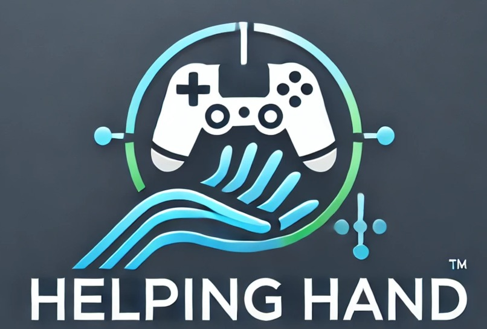

# Helping Hand
## Submission to the HackSussex 2025 Hackathon 



## About
AI screen analysis software engineered specifically to help disabled and less experienced players get the most out of their time playing games

## Features
- AI-driven screen analysis to provide contextual gaming assistance
- Real-time object recognition and explanation
- Voice-to-text and text-to-speech functionality for accessibility
- Intuitive UI for easy customization of settings

## Requirements
Ensure you have the following dependencies installed before running the project:

- Python 3.12+
- OpenAI API Key
- Eleven Labs API Key
- Make

## Installation & Setup
Follow these steps to set up and run the project:

1. **Clone the repository:**
   ```sh
   git clone https://github.com/Aleks-Tacconi/HelpingHand.git
   ```
2. **Navigate to the project directory**
    ```sh
    cd HelpingHand
    ```
3. **Create and activate a virtual environment:**
    ```sh
    python -m venv venv
    source venv/bin/activate  # On macOS/Linux
    venv\Scripts\activate  # On Windows
    ```
4. **Install dependencies**
    ```sh
    pip install -r requirements.txt
    ```
5. **Set the OpenAI and ElevenLabs API Keys**
    ```sh
    # On macOS/Linux
    export OPENAI_API_KEY="your_api_key"  
    export ELEVEN_LABS_API_KEY="your_api_key"

    # On Windows
    set OPENAI_API_KEY="your_api_key"  
    set ELEVEN_LABS_API_KEY="your_api_key"
    ```
6. **Run the project**
    ```sh
    python main.py
    ```

## Team Members
- **Aleksander Tacconi** - [GitHub](https://github.com/Aleks-Tacconi)
- **Daniel Cocos** - [GitHub](https://github.com/Daniel-Cocos)
- **Christopher White** - [GitHub](https://github.com/christopherwhite06)
- **Benjamin Millward** - [GitHub](https://github.com/GamanMil)

## Devpost Submission
For more details and contributions, visit our [Devpost project page](https://devpost.com/software/helping-hand-dx4b9m).
